# About

I am a Ph.D. Student in Computer Science and Engineering at the University of California, Santa Cruz (UCSC), advised by [Tyler Sorensen](https://users.soe.ucsc.edu/~tsorensen/) since Spring 2021. 

My research interests are heterogeneous computing, programming languages, and compiler techniques. In particular, I am working on HW/SW co-design for sparse applications, such as accelerating sparse tree applications on heterogeneous systems. Furthermore, I am interested in compiler techniques that automate this process, and I am also looking forward to developing novel programming models for sparse data structures.  

## Posters

### REDwood: Heterogenous Implementation of Tree Applications with Accelerated REDuctions
[[Extended Abstract]](img/redwood/PACT_2022.pdf) [[Poster]](img/redwood/PACT2022SRC.pdf) 

> We identify a class of applications, which we call traverse-REDuction applications, that have a flexible heterogeneous decomposition. We proposed a framework that provides a high-level interface to efficiently implement a wide range of traverse-REDuction algorithms. 

* Presented at International Conference on Parallel Architectures and Compilation Techniques (PACT 2022) as Student Research Competition

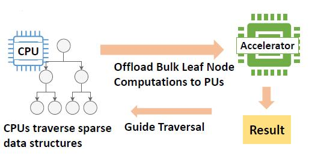

---

## Publications

* Conference: 2020 IEEE Intelligent Vehicles Symposium (IV)

* Authors: Ishaan Paranjape, Abdul Jawad, **Yanwen Xu**, Asiiah Song, Jim Whitehead

* Title: *A Modular Architecture for Procedural Generation of Towns, Intersections and Scenarios for Testing Autonomous Vehicles*

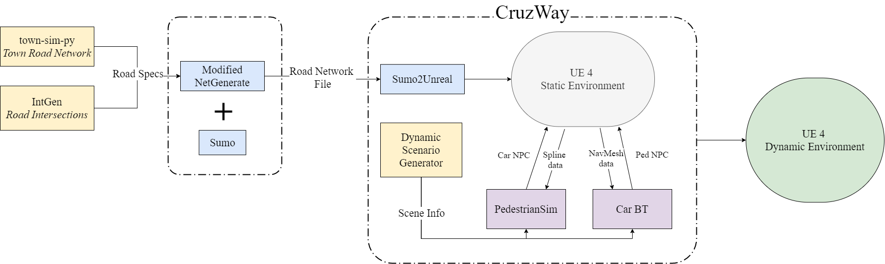

---

## Teaching

* TA, Compiler Design, UCSC, Spring 2022 

---

## Research Experiences (Undergrad)

### Interactive Generative 3D Shapes
[[Paper]](img/3d-shapes/paper_final.pdf) [[Slides]](img/3d-shapes/presentation.pdf) [[Code]](https://github.com/xuyanwen2012/interactive_generative_3d_shapes)

> Implemented a shrink-wrap algorithm from SIGGRAPH that can normalize similarly shaped 3D meshes for machine learning applications. We leveraged the power of an Autoencoder to explore the latent space behind the 3D shapes in the same category.

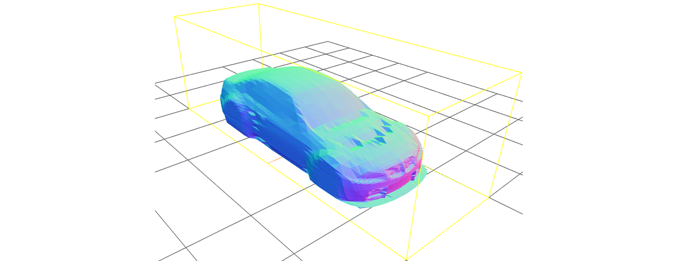

### Pedestrian Simulation for Autonomous Vehicles Testing

> Researched behavior tree approaches and social force models in Unreal Engine to procedurally generate testing scenarios and dynamically spawning navigation meshes for autonomous vehicle testing. Actively developing Unreal Plugins for [Augmented Design Lab](https://games.soe.ucsc.edu/adl) at UCSC. 

[[PedestrianSim]](https://github.com/xuyanwen2012/PedestrianSim) [[Sumo2Unreal]](https://github.com/AugmentedDesignLab/Sumo2Unreal) 

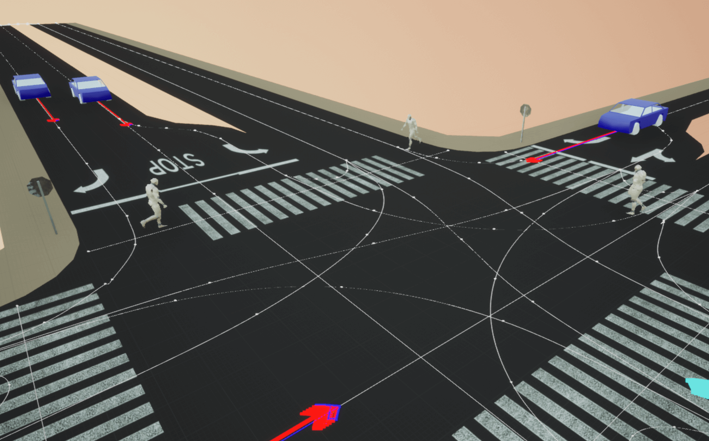
 

### 3D Interactive Dungeon Generation using SMT Solver

> Defined dungeon generation problems as linear constraint problems. We proposed a practical pipeline for level designers to generate dungeon layouts efficiently.

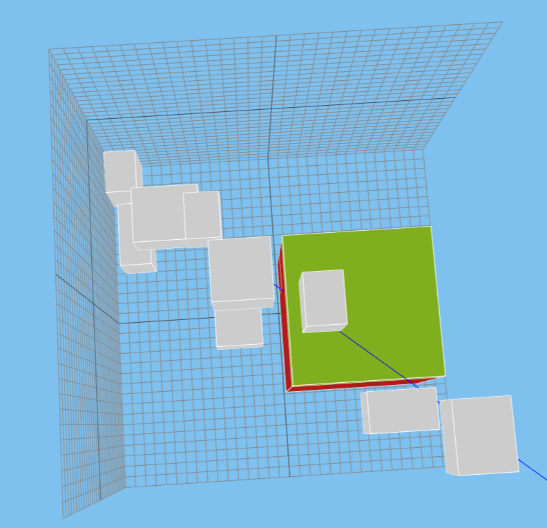

### Denoising Multipath Interference in Time-of-Flight Imaging
[[Paper]](img/3d-tof/Denoising_3D_Time_Of_Flight_Data.pdf) [[Code]](https://github.com/daemonslayer/3d-tof-denoising)

> We propose a novel method for MPI noise removal using a two-part convolutional neural network. We demonstrate and validate our results on a synthetic dataset.

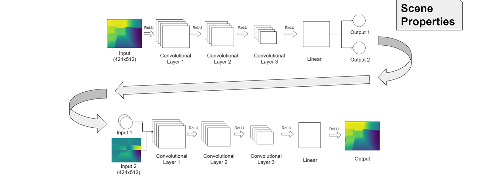

---

## Previous Programming Projects (Undergrad)

### 🌳 Featherweight Elm Interpreter in Rust
[[Code]](https://github.com/xuyanwen2012/elm-rust)

> An experimental lightweight interpreter for [Elm](https://elm-lang.org/) written in Rust. The project is inspired by the featherweight Elm language described in the original [Elm paper](https://elm-lang.org/assets/papers/concurrent-frp.pdf) by Evan Czaplicki. 

### Exploring Chaos Destruction with Niagara Particle System in Unreal Engine 4
[[Report]](img/chaos/Exploring_Chaos_Destruction_with_Niagara_Particle_System_in_Unreal_Engine_4.pdf) [[Video]](https://www.youtube.com/watch?time_continue=1&v=WnivTQNzUEw&feature=emb_logo)[[Code]](https://github.com/xuyanwen2012/ChaosProject) [[Official Epic Blog post (On the way...)]]

> We explored the Chaos Physics System and created a space-setting scene that demonstrated the aesthetic and robustness of massive destruction using Chaos.

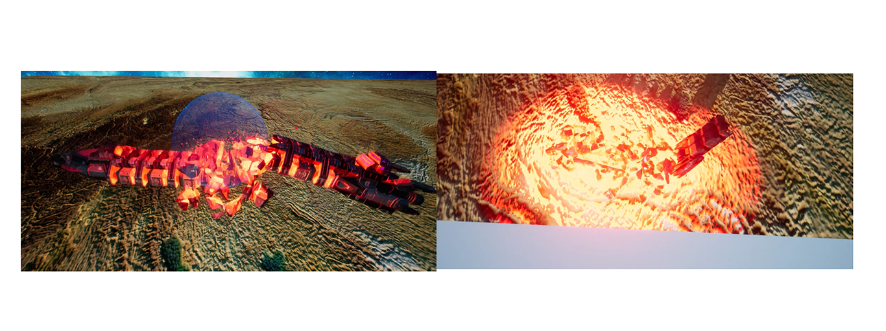

### Course Graph
[[Code]](https://github.com/coursegraph/CourseGraph)

> Course Graph is a lightning-fast web application to search for your UCSC/UCSD courses. Course Graph is built with Server Side Rendering Technology, as well as React, Node.js and MongoDB.

  

---

## Games (Undergrad)

### Real-time ARPG Battle System
[[YouTube Video]](https://www.youtube.com/watch?v=ddu1r0sn4vo) [[Code]](https://github.com/xuyanwen2012/RMMV-Battle-System-JS)

> A highly-reputed Combat system written in JavaScript for RPG Maker MV received overwhelmingly positive feedback from the Community. The combat systems have altered the turn-based J-RPG combat system in traditional RPG Maker Games to real-time Action RPG.   

<!-- 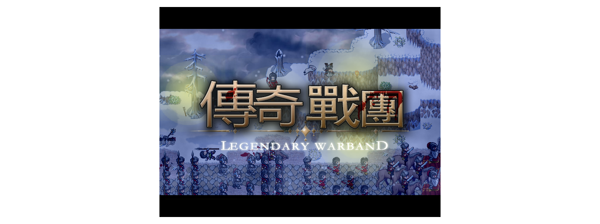 -->

### Legendary Warband
[[YouTube Video]](https://www.youtube.com/watch?v=2VEd8NKbcb4&t=11s) [[Code]](https://github.com/xuyanwen2012/XP-MBBS-7.0)

> Award-winning game series: Legendary Warband is a novel Action Rule-playing game made with RPG Maker Engine. In the game, the player can lead and combat hundreds of units in real time. The system is programmed in Ruby, and I created my own pixel art assets.  

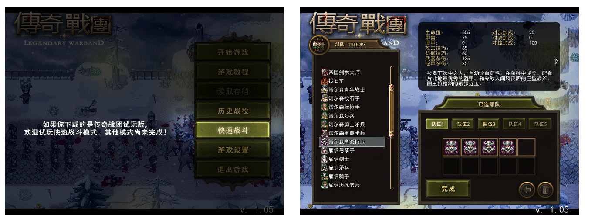

### Alterrain
[[Code]](https://github.com/IDANIO/Alterrain)

> An HTML5 Online Multiplayer exploration game implemented with Node.js and WebSocket. The first Online Multiplayer game project was done at UCSC for game design projects. Procedurally generated terrain. 

  

<!-- 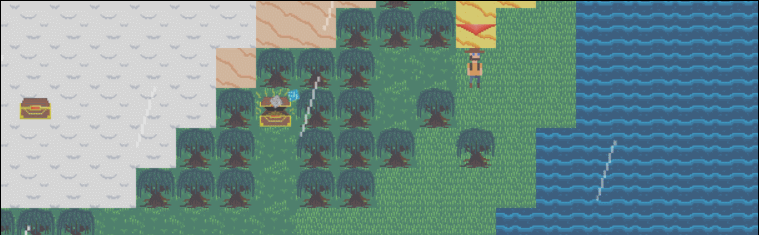 -->

### Groundbreakers Origin
[[Code]](https://github.com/Groundbreakers/Groundbreakers)

> My undergraduate Capstone Project for my Game Design major. A rogue-like tower-defense RPG game with novel terrain-alteration mechanics. Developed in Unity with C#. Moreover, I developed editor plugins using OdinInspector to help our designers to create enemies easier.    

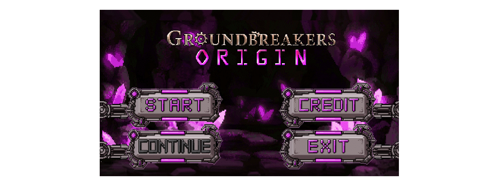

---

## Misc (Undergrad)

### 🎺ToyTracer
[[Code]](https://github.com/xuyanwen2012/ToyTracer)

> A naive toy Ray Tracer built from scratch for the Game Engine class in Modern C++ 11. Including Phong Lighting, Reflection & Refraction, Fresnel Effect, and Gamma Correction.  

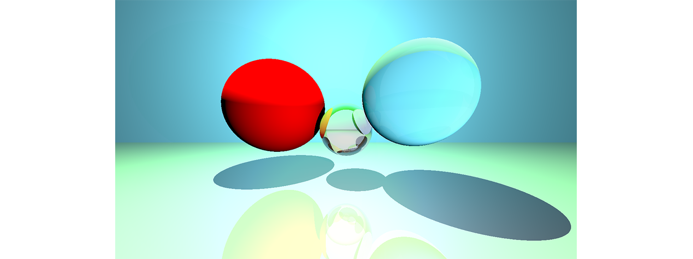

### WebGL Minecraft
[[Demo]](https://people.ucsc.edu/~yxu83/asg7/)

> A Simple WebGL implementation of an Interactive Minecraft Editor. Including Blinn-Phong, HUD, FOG, Alpha Blending, Collision Detection, Skybox, and Terrain generation. 

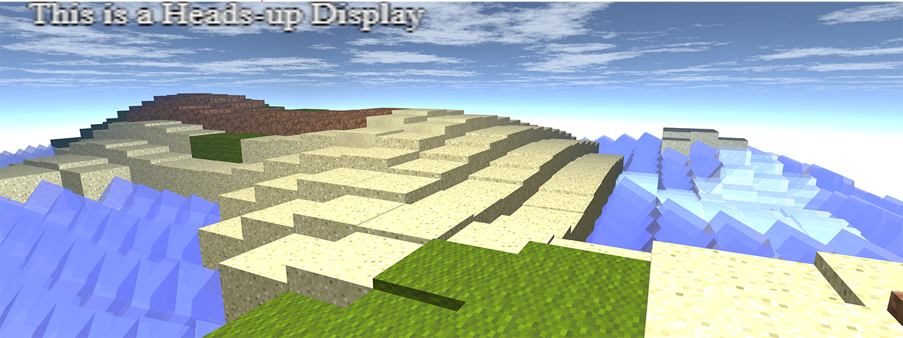
